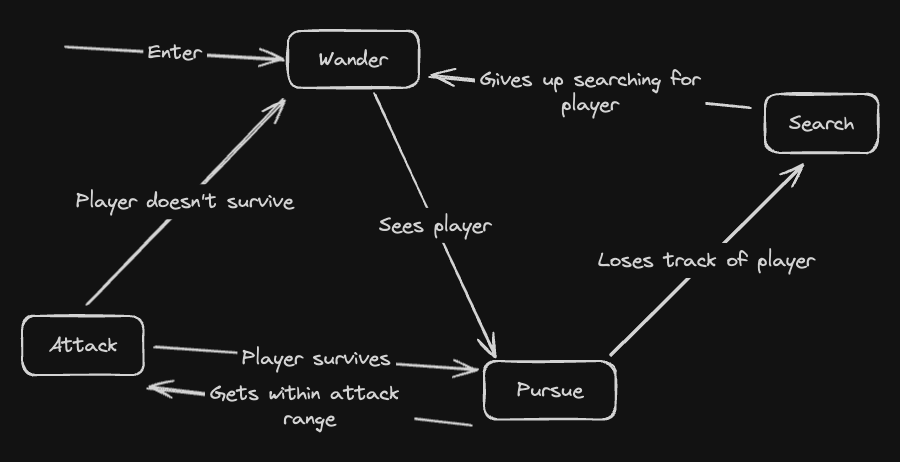

# Pursue AI Test

This is a test project I've put together to let others try interacting with an AI for a game I'm working on.

The behavior is supposed to resemble that of the lizards from [Rain World](https://store.steampowered.com/app/312520/Rain_World/). However, I have never played Rain World, so I'm just kind of guessing. In the game this AI will control a creature that hunts down the player.

Internally, this AI is going to be a state machine that looks something like this:

## TODO

- [ ] States

  - [ ] Wander
  - [ ] Pursue
  - [ ] Search
  - [ ] Attack

- [ ] Transitions

  - [ ] AI sees player
  - [ ] AI loses track of the player
  - [ ] AI gives up searching for the player
  - [ ] AI gets within attack range of the player
  - [ ] Player survives the AI attack
  - [ ] Player doesn't survive the AI attack
